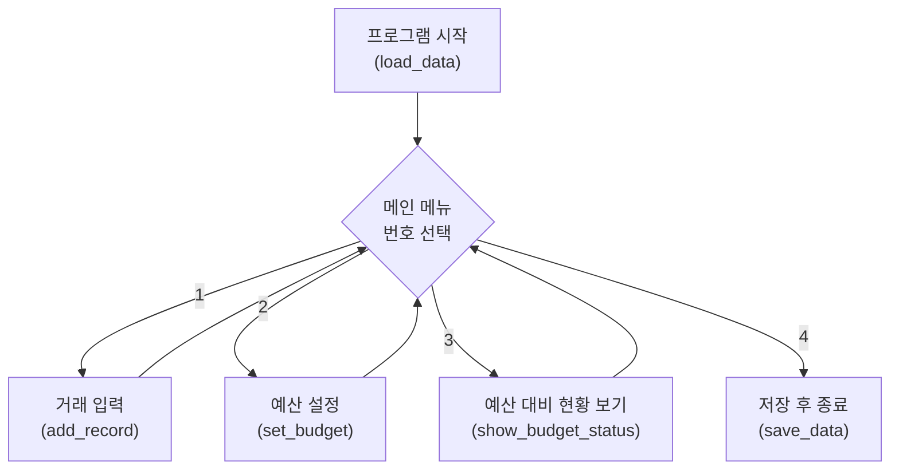

[02_design (1).md](https://github.com/user-attachments/files/28632743/02_design.1.md)
# Campus Wallet — 설계 문서 (2단계)

> **프로젝트:** 대학생 예산 도우미 가계부 (Campus Wallet)
> **단계:** 2단계 — 기획 및 설계
> **결과물 형태:** CLI (터미널 메뉴 방식)

---

## 한 문장 설명

> 카테고리별 예산을 정해두면, 지출할 때마다 얼마나 썼는지·하루에 얼마 쓸 수 있는지 알려주는 **대학생 예산 도우미** 가계부

기존 가계부가 *과거를 기록*하는 데 그친다면, Campus Wallet은 예산이라는 기준을 두고 *앞으로의 소비를 관리*하도록 돕는다.

---

## 1. 기능 목록

우선순위: **MUST**(반드시) / **NICE**(있으면 좋음) / **LATER**(시간 남으면)

```
[MUST]  수입/지출 한 건 입력받기 (날짜, 카테고리, 금액, 메모)
[MUST]  기록을 CSV 파일에 저장하고, 다시 켜면 불러오기
[MUST]  카테고리별 한 달 예산 설정하기            ← 차별화의 뿌리
[MUST]  예산 대비 현황 보기 (카테고리별 합계 + 사용률 % + 잔액)
[NICE]  기록 직후 예산 초과 경고 띄우기             ← 차별화 ①
[NICE]  남은 날 대비 하루 가능 예산 계산하기         ← 차별화 ②
[NICE]  지출 TOP 카테고리 + 소비 습관 한 줄 코멘트   ← 차별화 ③
[LATER] 월별 추세를 그래프로 시각화하기
```

세 가지 차별화 기능(①②③)은 모두 **"예산"이라는 하나의 뿌리**에서 파생된다. 그래서 `카테고리별 예산 설정`을 MUST에 두고, 나머지 가지들은 시간이 생기는 순서대로 붙인다.

---

## 2. 데이터 구조 설계

프로그램이 저장하는 정보는 **거래 기록**(여러 건)과 **예산 설정**(카테고리당 한 개) 두 종류다.

### 거래 기록 — 한 건은 딕셔너리, 전체는 리스트

```python
# 거래 한 건 = 딕셔너리 (칸마다 이름표가 붙은 상자)
record = {
    "date": "2026-05-07",   # 날짜
    "category": "식비",      # 카테고리
    "amount": -5000,         # 금액: 음수=지출, 양수=수입
    "memo": "학식",          # 메모
}

# 거래 전체 = 리스트 (상자들을 순서대로 담은 줄)
records = [record1, record2, record3, ...]
```

- 딕셔너리를 쓰는 이유: `record["category"]`처럼 **이름으로** 값을 꺼낼 수 있어 코드가 읽기 쉽다.
- 수입/지출은 **금액의 부호**로 구분한다(수입 `+`, 지출 `-`). 별도의 구분 칸이 필요 없고, **잔액 = 모든 amount의 합**으로 간단히 계산된다.

### 예산 설정 — 카테고리별 한도 딕셔너리

```python
budgets = {
    "식비": 100000,
    "교통": 30000,
    "여가": 50000,
}
# 식비 예산 확인: budgets["식비"]  →  100000
```

### 파일 저장 — CSV 두 개

거래 기록과 예산은 모양이 다르므로 파일을 따로 둔다.

| 파일 | 내용 | 열(컬럼) |
|------|------|----------|
| `records.csv` | 거래 기록 | date, category, amount, memo |
| `budgets.csv` | 예산 설정 | category, budget |

> ⚠️ **주의:** CSV에서 읽어온 값은 모두 **문자열**이다. 금액으로 계산하려면 `int(값)`으로 숫자로 바꿔야 한다. (`"5000" + "3000"` → `"50003000"` 가 되는 함정)

---

## 3. 함수 의사코드

각 함수의 **입력(매개변수)과 출력(반환값)**만 정하고, 내부는 한국어 주석으로 비워둔다.
(실제 구현은 3단계에서 채운다.)

```python
def load_data():
    # 1. records.csv 를 읽어 거래 리스트로 만든다 (파일 없으면 빈 리스트)
    # 2. budgets.csv 를 읽어 예산 딕셔너리로 만든다 (없으면 빈 딕셔너리)
    # 3. (records, budgets) 두 개를 반환한다
    pass


def add_record(records, date, category, amount, memo):
    # 입력: 거래 리스트 + 거래 정보 (amount는 이미 부호가 붙은 숫자)
    # 1. 받은 정보로 딕셔너리 한 건을 만든다
    # 2. records 리스트에 추가한다
    # 출력: 갱신된 records
    pass


def set_budget(budgets, category, limit):
    # 입력: 예산 딕셔너리 + 카테고리 + 한도 금액
    # 1. budgets[category] = limit 으로 설정/수정한다
    # 출력: 갱신된 budgets
    pass


def spent_by_category(records):
    # 입력: 거래 리스트
    # 1. amount 가 음수인 거래(=지출)만 본다
    # 2. 카테고리별로 -amount 를 더해 합계를 모은다
    # 출력: {카테고리: 지출합계} 딕셔너리
    pass


def show_budget_status(records, budgets):
    # 입력: 거래 리스트 + 예산 딕셔너리
    # 1. spent_by_category(records) 로 카테고리별 지출을 구한다
    # 2. 카테고리마다 "쓴 금액 / 예산 (사용률 %)" 를 보기 좋게 출력한다
    # 3. 잔액 = 모든 amount 의 합 을 출력한다
    pass


def save_data(records, budgets):
    # 입력: 거래 리스트 + 예산 딕셔너리
    # 1. records 를 records.csv 에 저장한다
    # 2. budgets 를 budgets.csv 에 저장한다
    pass
```

> **설계 포인트:** `show_budget_status` 는 직접 계산하지 않고 `spent_by_category` 를 **불러서** 쓴다. 합계 계산과 출력을 분리해 두면, NICE 기능(예산 초과 경고, 하루 예산)에서도 `spent_by_category` 를 그대로 재사용할 수 있다.

---

## 4. 화면 흐름

켜면 데이터를 불러오고, 메인 메뉴에서 기능을 고르고, 작업이 끝나면 다시 메뉴로 돌아오는 **반복 구조**다.



### 화면 예시 — 메인 메뉴

```
===== Campus Wallet =====
  1. 거래 입력
  2. 예산 설정
  3. 예산 대비 현황 보기
  4. 종료
번호를 입력하세요: _
```

### 화면 예시 — 예산 대비 현황 보기 (차별점이 드러나는 화면)

```
===== 5월 예산 현황 =====
  식비   80,000 / 100,000원  (80% 사용)
  교통   25,000 /  30,000원  (83% 사용)
  여가   62,000 /  50,000원  (124% 사용)
------------------------------------
  이번 달 잔액: +133,000원
```

단순 합계가 아니라 **예산 대비 사용률**이 한눈에 보인다. 100%를 넘은 줄에 `⚠ 초과!` 경고를 붙이면 NICE 기능 ①이 된다.

> 📝 **TODO:** 손그림 화면 흐름 스케치 사진을 여기에 추가하기 (``)

---

## 사용할 Python 개념

| 개념 | 활용 |
|------|------|
| 변수 / 자료형 | 금액, 날짜, 카테고리 저장 |
| 리스트 / 딕셔너리 | 거래 목록, 카테고리별 합계·예산 |
| 함수 | 기능별 분리 (기록·요약·분석) |
| 조건문 / 반복문 | 메뉴 선택, 데이터 순회·필터링 |
| 파일 입출력 (CSV) | 종료 후에도 데이터 유지 |
